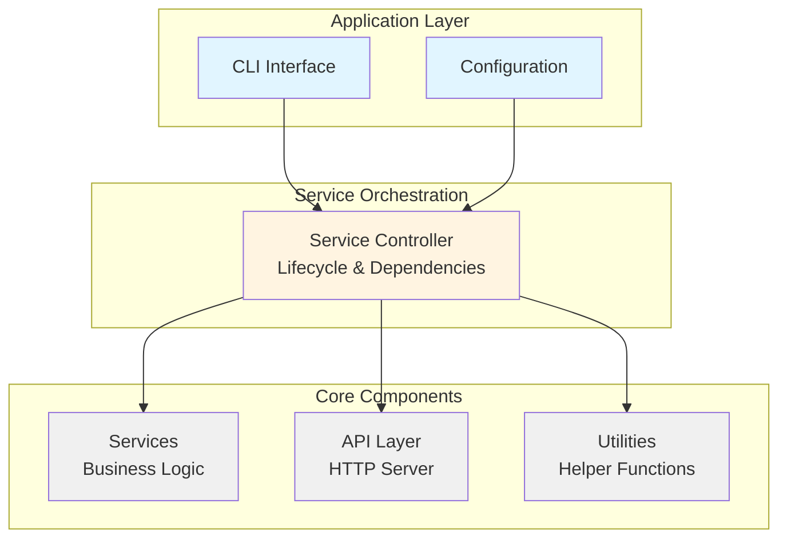
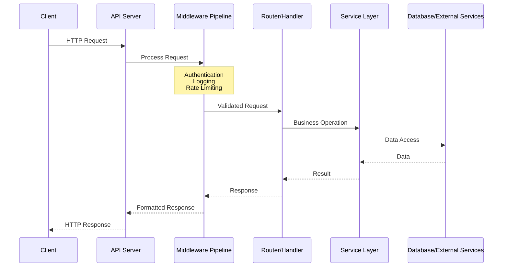

# Framingo

[](LICENSE)
[](https://go.dev/)

**Framingo** is a modular, service-oriented Go framework for building production-ready HTTP API applications. It provides a comprehensive set of tools, utilities, and architectural patterns to help you quickly develop scalable, maintainable backend services.

## Features

- **Service-Oriented Architecture** - Built-in service lifecycle management with automatic dependency resolution

- **HTTP API Server** - Production-ready API server with routing, middleware, and rate limiting

- **Rich Utilities** - Extensive collection of utility packages for common operations

- **Modular Design** - Pick and choose components based on your needs

- **Configuration Management** - YAML-based configuration with environment variable overrides

- **Database Integration** - Database manager with connection pooling and migrations

- **CLI Support** - Built-in command-line interface framework integration

- **Production Ready** - Error handling, logging, graceful shutdown, and profiling support

## Table of Contents

- [Quick Start](#quick-start)
- [Architecture](#architecture)
- [Core Modules](#core-modules)
- [Building Your First Application](#building-your-first-application)
- [Documentation](#documentation)
- [Examples](#examples)
- [Contributing](#contributing)
- [License](#license)

## Quick Start

### Installation

```bash
go get github.com/xhanio/framingo
```

### Your First Application

Create a simple HTTP API server in minutes:

```go
// cmd/myapp/main.go
package main

import (
    "fmt"
    "os"

    "github.com/xhanio/framingo/example/pkg/components/cmd/example"
)

func main() {
    rootCmd := example.NewRootCmd()
    if err := rootCmd.Execute(); err != nil {
        fmt.Fprintf(os.Stderr, "Error: %v\n", err)
        os.Exit(1)
    }
}
```

```yaml
# config.yaml
log:
  level: 0  # 0=Debug, 1=Info, 2=Warn, 3=Error

api:
  http:
    host: 0.0.0.0
    port: 8080
    prefix: /api/v1
```

```bash
# Build and run
go build -o myapp cmd/myapp/main.go
./myapp daemon -c config.yaml

# Test the API
curl -X GET "http://localhost:8080/api/v1/demo/example?message=Hello"
# Response: {"id":1,"message":"Hello","created_at":"...","updated_at":"..."}
```

**For a complete tutorial**, see the [Building Your First Application](#building-your-first-application) section and [Complete Application Guide](example/README.md).

## Architecture

Framingo follows a layered architecture pattern:



### Request Flow



## Core Modules

Framingo is organized into four core module categories under `pkg/`:

### Services (`pkg/services/`)

Production-ready service implementations that provide core functionality:

- **[api/server](pkg/services/api/server/)** - HTTP API server with Echo framework integration
  - Route management and handler registration
  - Built-in middleware (error handling, logging, rate limiting)
  - Multiple server support with TLS
  - YAML-based route configuration
  - Request/response lifecycle management

- **[api/client](pkg/services/api/client/)** - HTTP client utilities for making API requests

- **[controller](pkg/services/controller/)** - Service lifecycle orchestration
  - Automatic dependency resolution via topological sort
  - Service registration and initialization
  - Graceful startup and shutdown
  - Signal handling

- **[db](pkg/services/db/)** - Database manager with GORM integration
  - Connection pooling with configurable limits
  - Migration support
  - Multiple database types (PostgreSQL, MySQL, SQLite)
  - Context-aware operations

- **[planner](pkg/services/planner/)** - Task scheduling and planning service

- **[pubsub](pkg/services/pubsub/)** - Publish-subscribe messaging pattern implementation

### Types (`pkg/types/`)

Core interfaces and type definitions used throughout the framework:

- **[common](pkg/types/common/)** - Common interfaces
  - `Service` - Base service interface with name and dependencies
  - `Daemon` - Start/Stop lifecycle methods
  - `Initializable` - Initialization interface
  - `Named`, `Unique`, `Weighted` - Utility interfaces

- **[api](pkg/types/api/)** - HTTP API related types
  - `Router`, `Middleware`, `Handler` interfaces
  - Request/Response types
  - Error categories

- **[info](pkg/types/info/)** - Application metadata (version, build info, commit hash)

### Data Structures (`pkg/structs/`)

Efficient, generic data structures for common algorithms:

- **[buffer](pkg/structs/buffer/)** - Ring buffer implementation with fixed capacity
- **[graph](pkg/structs/graph/)** - Generic graph structure with topological sort (used by controller)
- **[lease](pkg/structs/lease/)** - Time-based lease management for resource allocation
- **[queue](pkg/structs/queue/)** - FIFO queue implementation
- **[staque](pkg/structs/staque/)** - Hybrid stack/queue data structure
- **[trie](pkg/structs/trie/)** - Prefix tree for efficient string matching

### Utilities (`pkg/utils/`)

Helper packages for common tasks:

- **[certutil](pkg/utils/certutil/)** - Certificate and TLS utilities
- **[cmdutil](pkg/utils/cmdutil/)** - Command execution helpers
- **[infra](pkg/utils/infra/)** - Infrastructure helpers (signals, profiling, pprof)
- **[ioutil](pkg/utils/ioutil/)** - I/O operations and file utilities
- **[job](pkg/utils/job/)** - Background job execution framework
- **[log](pkg/utils/log/)** - Structured logging with zap integration and file rotation
- **[maputil](pkg/utils/maputil/)** - Map and set utilities
- **[netutil](pkg/utils/netutil/)** - Network utilities
- **[pathutil](pkg/utils/pathutil/)** - Path manipulation helpers
- **[printutil](pkg/utils/printutil/)** - Pretty printing utilities
- **[reflectutil](pkg/utils/reflectutil/)** - Reflection helpers
- **[sliceutil](pkg/utils/sliceutil/)** - Slice manipulation utilities
- **[strutil](pkg/utils/strutil/)** - String utilities
- **[task](pkg/utils/task/)** - Task management utilities
- **[timeutil](pkg/utils/timeutil/)** - Time-related utilities

## Building Your First Application

### Step 1: Project Setup

```bash
# Create your project structure
mkdir -p myapp/{cmd/myapp,pkg/{services,routers,middlewares,types/{api,entity,orm},components/{cmd,server},utils}}
cd myapp

# Initialize Go module
go mod init github.com/yourorg/myapp

# Get Framingo
go get github.com/xhanio/framingo

# Your project structure should look like:
# myapp/
# ├── cmd/
# │   └── myapp/           # Application entry point
# ├── pkg/
# │   ├── components/
# │   │   ├── cmd/         # CLI commands
# │   │   └── server/      # Server orchestration
# │   ├── services/        # Business logic
# │   ├── routers/         # HTTP handlers
# │   ├── middlewares/     # HTTP middleware
# │   ├── types/           # Type definitions
# │   │   ├── api/         # API request/response types with validation
# │   │   ├── entity/      # Business entities (pure domain models)
# │   │   └── orm/         # ORM models for database operations
# │   └── utils/           # Utilities
# └── config.yaml          # Configuration
```

### Step 2: Define Your Service

Services contain your business logic with lifecycle management.

```go
// pkg/services/hello/model.go
package hello

import (
    "context"
    "github.com/xhanio/framingo/pkg/types/common"
)

type Manager interface {
    common.Service
    common.Initializable
    common.Daemon
    SayHello(ctx context.Context, name string) (string, error)
}
```

```go
// pkg/services/hello/manager.go
package hello

import (
    "context"
    "fmt"
    "github.com/xhanio/framingo/pkg/types/common"
    "github.com/xhanio/framingo/pkg/utils/log"
)

type manager struct {
    log log.Logger
}

// Option pattern for optional dependencies
type Option func(*manager)

func WithLogger(logger log.Logger) Option {
    return func(m *manager) { m.log = logger }
}

func New(opts ...Option) Manager {
    m := &manager{}
    for _, opt := range opts {
        opt(m)
    }
    if m.log == nil {
        m.log = log.Default
    }
    return m
}

func (m *manager) Name() string { return "hello-service" }
func (m *manager) Dependencies() []common.Service { return nil }
func (m *manager) Init() error {
    m.log.Info("Initializing hello service")
    return nil
}
func (m *manager) Start(ctx context.Context) error {
    m.log.Info("Starting hello service")
    return nil
}
func (m *manager) Stop(wait bool) error {
    m.log.Info("Stopping hello service")
    return nil
}

func (m *manager) SayHello(ctx context.Context, name string) (string, error) {
    m.log.Infof("Saying hello to %s", name)
    return fmt.Sprintf("Hello, %s!", name), nil
}
```

### Step 3: Create HTTP Router

Routers define HTTP endpoints and handlers using YAML configuration.

```go
// pkg/routers/hello/router.go
package hello

import (
    _ "embed"

    "github.com/labstack/echo/v4"
    "github.com/xhanio/framingo/pkg/types/api"
    "github.com/xhanio/framingo/pkg/types/common"
    "myapp/pkg/services/hello"
)

//go:embed router.yaml
var config []byte

type router struct {
    helloSvc hello.Manager
}

func New(svc hello.Manager) api.Router {
    return &router{helloSvc: svc}
}

func (r *router) Name() string { return "hello-router" }
func (r *router) Dependencies() []common.Service { return []common.Service{r.helloSvc} }
func (r *router) Config() []byte { return config }

func (r *router) Handlers() map[string]echo.HandlerFunc {
    return map[string]echo.HandlerFunc{
        "Hello": r.Hello,
    }
}

func (r *router) Hello(c echo.Context) error {
    name := c.QueryParam("name")
    if name == "" {
        name = "World"
    }

    msg, err := r.helloSvc.SayHello(c.Request().Context(), name)
    if err != nil {
        return err
    }

    return c.JSON(200, map[string]string{"message": msg})
}
```

```yaml
# pkg/routers/hello/router.yaml
server: http
prefix: /hello
handlers:
  - method: GET
    path: /
    func: Hello
```

### Step 4: Wire It All Together

Create a server component to orchestrate your services and routers.

```go
// pkg/components/server/myapp/manager.go
package myapp

import (
    "context"
    "fmt"
    "os"

    "github.com/spf13/viper"
    "github.com/xhanio/framingo/pkg/services/api/server"
    "github.com/xhanio/framingo/pkg/services/controller"
    "github.com/xhanio/framingo/pkg/types/common"
    "github.com/xhanio/framingo/pkg/utils/infra"
    "github.com/xhanio/framingo/pkg/utils/log"

    "myapp/pkg/services/hello"
    helloRouter "myapp/pkg/routers/hello"
)

type Manager interface {
    common.Daemon
}

type manager struct {
    log      log.Logger
    services *controller.Manager
    api      server.Manager
    helloSvc hello.Manager
}

func New() Manager {
    return &manager{}
}

func (m *manager) Init() error {
    // Initialize logger
    m.log = log.New(log.WithLevel(viper.GetInt("log.level")))

    // Initialize service controller
    m.services = controller.New(controller.WithLogger(m.log))

    // Create API server
    m.api = server.New(server.WithLogger(m.log))
    httpConfig := viper.Sub("api.http")
    if httpConfig != nil {
        m.api.Add("http",
            server.WithEndpoint(
                httpConfig.GetString("host"),
                httpConfig.GetInt("port"),
                httpConfig.GetString("prefix"),
            ),
        )
    }

    // Initialize your service (with optional logger)
    m.helloSvc = hello.New(hello.WithLogger(m.log))

    // Register services
    m.services.Register(m.helloSvc)

    // Resolve dependencies
    if err := m.services.TopoSort(); err != nil {
        return err
    }

    // Add API server (must be last)
    m.services.Register(m.api)

    // Initialize all services
    if err := m.services.Init(); err != nil {
        return err
    }

    // Register routers
    return m.api.RegisterRouters(helloRouter.New(m.helloSvc))
}

func (m *manager) Start(ctx context.Context) error {
    // Handle signals
    go infra.HandleSignals(m.log, m.services)

    // Start all services
    return m.services.Start(ctx)
}

func (m *manager) Stop(wait bool) error {
    return m.services.Stop(wait)
}
```

```go
// cmd/myapp/main.go
package main

import (
    "fmt"
    "os"

    "github.com/spf13/cobra"
    "github.com/spf13/viper"

    "myapp/pkg/components/server/myapp"
)

func main() {
    var configFile string

    rootCmd := &cobra.Command{Use: "myapp"}

    daemonCmd := &cobra.Command{
        Use: "daemon",
        RunE: func(cmd *cobra.Command, args []string) error {
            // Load configuration
            viper.SetConfigFile(configFile)
            viper.SetEnvPrefix("MYAPP")
            viper.AutomaticEnv()

            if err := viper.ReadInConfig(); err != nil {
                return fmt.Errorf("failed to read config: %w", err)
            }

            // Initialize and start server
            mgr := myapp.New()
            if err := mgr.Init(); err != nil {
                return err
            }
            return mgr.Start(cmd.Context())
        },
    }
    daemonCmd.Flags().StringVarP(&configFile, "config", "c", "config.yaml", "config file path")

    rootCmd.AddCommand(daemonCmd)
    if err := rootCmd.Execute(); err != nil {
        fmt.Fprintf(os.Stderr, "Error: %v\n", err)
        os.Exit(1)
    }
}
```

### Step 5: Run and Test

```bash
# Build your application
go build -o myapp cmd/myapp/main.go

# Run the server
./myapp daemon -c config.yaml

# Test the endpoint
curl http://localhost:8080/api/v1/hello?name=Framingo
# Response: {"message": "Hello, Framingo!"}
```

**For more details**, see the [Complete Application Guide](example/README.md) with comprehensive examples of all components.

## Documentation

### Comprehensive Guides

- **[Complete Application Guide](example/README.md)** - Full tutorial with all components and production deployment
- **[Type Separation Guide](example/pkg/types/README.md)** - Understanding API, Entity, and ORM type separation
- **[Service Layer](example/pkg/services/README.md)** - Building business logic services with lifecycle management
- **[HTTP Routers](example/pkg/routers/README.md)** - Creating API endpoints with YAML-based configuration
- **[Middleware](example/pkg/middlewares/README.md)** - Request processing pipeline and custom middleware
- **[Server Component](example/pkg/components/server/README.md)** - Application orchestration and dependency management
- **[CLI Component](example/pkg/components/cmd/README.md)** - Command-line interface with Cobra

### Framework API Reference

Browse the framework source code:

- **[Services API](pkg/services/)** - API server, controller, database, pubsub
- **[Types](pkg/types/)** - Common interfaces and API types
- **[Utilities](pkg/utils/)** - Logger, infrastructure, and helper packages
- **[Data Structures](pkg/structs/)** - Graph, queue, buffer, trie implementations

### Go Documentation

View package documentation using go doc:

```bash
# View package documentation
go doc github.com/xhanio/framingo/pkg/services/api/server
go doc github.com/xhanio/framingo/pkg/services/controller
go doc github.com/xhanio/framingo/pkg/utils/log
```

## Examples

The `example/` directory contains a complete, production-ready application demonstrating all framework features:

```
example/
+-- pkg/
    +-- components/
    |   +-- cmd/example/        # CLI with Cobra (daemon, version commands)
    |   +-- server/example/     # Server orchestration and lifecycle management
    +-- services/example/       # Business service with lifecycle methods
    +-- routers/example/        # HTTP routes with YAML configuration
    +-- middlewares/example/    # Custom middleware (deflate compression)
    +-- types/                  # Type definitions (separated by purpose)
    |   +-- api/                # API request/response types with validation
    |   +-- entity/             # Business entities (pure domain models)
    |   +-- orm/                # ORM models for database operations
    +-- utils/                  # Utility modules
        +-- infra/              # Infrastructure utilities
+-- README.md                   # Complete application guide
```

### Running the Example

```bash
# Clone the repository
git clone https://github.com/xhanio/framingo.git
cd framingo

# Create a config file
cat > config.yaml <<EOF
log:
  level: 0
api:
  http:
    host: 0.0.0.0
    port: 8080
    prefix: /api/v1
EOF

# Create a main.go that uses the example components
cat > cmd/example/main.go <<EOF
package main

import (
    "fmt"
    "os"
    "github.com/xhanio/framingo/example/pkg/components/cmd/example"
)

func main() {
    rootCmd := example.NewRootCmd()
    if err := rootCmd.Execute(); err != nil {
        fmt.Fprintf(os.Stderr, "Error: %v\n", err)
        os.Exit(1)
    }
}
EOF

# Build and run
go build -o myapp cmd/example/main.go
./myapp daemon -c config.yaml

# Test the API
curl -X GET "http://localhost:8080/api/v1/demo/example?message=Hello%20World"
# Response: {"id":1,"message":"Hello World","created_at":"...","updated_at":"..."}
```

**For detailed setup and configuration**, see [example/README.md](example/README.md)

### Example Features Demonstrated

- ✅ Service lifecycle management with dependency injection
- ✅ HTTP API with routing and request validation
- ✅ Type separation (API/Entity/ORM) for clean architecture
- ✅ Database integration with ORM models
- ✅ Custom middleware (deflate compression)
- ✅ YAML-based configuration with environment overrides
- ✅ CLI with multiple commands (daemon, version)
- ✅ Graceful shutdown and signal handling
- ✅ Structured logging with file rotation
- ✅ Service dependencies with automatic resolution
- ✅ Multiple API servers support

## Key Concepts

### Type Separation

Framingo promotes clean architecture through type separation:

```go
// API Types - Request/response with validation
type CreateUserRequest struct {
    Username string `json:"username" validate:"required"`
    Email    string `json:"email" validate:"required,email"`
}

// Entity Types - Pure business models
type User struct {
    ID       int64  `json:"id"`
    Username string `json:"username"`
    Email    string `json:"email"`
}

// ORM Types - Database models
type User struct {
    ID       int64  `gorm:"primaryKey"`
    Username string `gorm:"type:varchar(100);not null"`
    Email    string `gorm:"type:varchar(255);not null"`
}

func (User) TableName() string { return "users" }
```

**Benefits:**
- API contracts independent of storage
- Business logic isolated from infrastructure
- Easy to test and maintain
- Flexibility to change database without affecting API

### Service Lifecycle

All services implement a standard lifecycle:

```go
type Service interface {
    Name() string
    Dependencies() []common.Service
}

type Initializable interface {
    Init() error
}

type Daemon interface {
    Start(context.Context) error
    Stop(wait bool) error
}
```

### Dependency Management

Services declare their dependencies via constructor arguments (required) and options (optional):

```go
// Required dependencies as constructor arguments
func New(database db.Manager, opts ...Option) Manager {
    m := &manager{db: database}
    for _, opt := range opts {
        opt(m)
    }
    return m
}

// Service declares dependencies for lifecycle management
func (s *myService) Dependencies() []common.Service {
    return []common.Service{s.database}
}

// Controller automatically starts: database -> myService
```

### Router Configuration

Routers use YAML configuration for declarative route definition:

```yaml
server: http
prefix: /api/users
handlers:
  - method: GET
    path: /:id
    func: GetUser
  - method: POST
    path: /
    func: CreateUser
    middleware: auth
```

### Middleware Pipeline

Middlewares process requests in order:

```
Request -> Recover -> Info -> Throttle -> Logger -> Custom -> Handler -> Response
```

## Configuration

Framingo uses Viper for configuration management with priority:

1. **Command-line flags** (highest)
2. **Environment variables**
3. **YAML configuration file**
4. **Default values** (lowest)

```yaml
# config.yaml
log:
  level: 0  # 0=Debug, 1=Info, 2=Warn, 3=Error
  file: /var/log/app.log

db:
  type: postgres
  source:
    host: localhost
    port: 5432

api:
  http:
    host: 0.0.0.0
    port: 8080
    prefix: /api/v1
    throttle:
      rps: 100.0
      burst_size: 200
```

Environment variable override:
```bash
export FRAMINGO_API_HTTP_PORT=9090
```

## Production Deployment

### Docker

```dockerfile
FROM golang:1.21 AS builder
WORKDIR /app
COPY . .
RUN go build -o app cmd/app/main.go

FROM alpine:latest
COPY --from=builder /app/app /usr/local/bin/
COPY config.yaml /etc/app/
CMD ["app", "daemon", "-c", "/etc/app/config.yaml"]
```

### Kubernetes

```yaml
apiVersion: apps/v1
kind: Deployment
metadata:
  name: myapp
spec:
  replicas: 3
  template:
    spec:
      containers:
      - name: myapp
        image: myapp:latest
        ports:
        - containerPort: 8080
```

### Systemd

```ini
[Unit]
Description=My Framingo App

[Service]
ExecStart=/usr/local/bin/myapp daemon -c /etc/myapp/config.yaml
Restart=on-failure

[Install]
WantedBy=multi-user.target
```

## Best Practices

1. **Architecture & Types**
   - Separate types by purpose: `api/` for requests, `entity/` for business, `orm/` for database
   - Pass required dependencies as constructor arguments, not options
   - Keep business logic independent of infrastructure concerns
   - Use interfaces for testability and flexibility

2. **Service Design**
   - Keep services focused and single-purpose
   - Declare dependencies explicitly in `Dependencies()` method
   - Implement standard lifecycle methods (`Init`, `Start`, `Stop`)
   - Convert between ORM and entity types in service layer

3. **Error Handling**
   - Use error wrapping for context (`errors.Wrap`)
   - Return appropriate HTTP status codes (BadRequest, NotFound, etc.)
   - Log errors at service boundaries
   - Validate requests using API types with validation tags

4. **Configuration**
   - Use YAML for structure and hierarchy
   - Use env vars for secrets and environment-specific values
   - Validate configuration on startup
   - Follow configuration priority: flags > env vars > file > defaults

5. **Testing**
   - Test services independently with mocked dependencies
   - Test handlers with API type validation
   - Integration tests for full request flow
   - Test ORM to entity conversions

6. **Performance**
   - Enable database connection pooling
   - Configure rate limiting per endpoint or server-wide
   - Use pprof for profiling bottlenecks
   - Cache frequently accessed data when appropriate

## Contributing

Contributions are welcome! Please feel free to submit a Pull Request.

1. Fork the repository
2. Create your feature branch (`git checkout -b feature/amazing-feature`)
3. Commit your changes (`git commit -m 'Add some amazing feature'`)
4. Push to the branch (`git push origin feature/amazing-feature`)
5. Open a Pull Request

## License

This project is licensed under the Apache License 2.0 - see the [LICENSE](LICENSE) file for details.

## Resources & Support

### Documentation

- **[Complete Application Guide](example/README.md)** - Full tutorial and production deployment guide
- **[Example Components](example/pkg/)** - Reference implementations of all components

### Community

- **[Issue Tracker](https://github.com/xhanio/framingo/issues)** - Bug reports and feature requests
- **[Discussions](https://github.com/xhanio/framingo/discussions)** - Questions and community support

## Acknowledgments

Built with:
- [Echo](https://echo.labstack.com/) - High performance HTTP framework
- [Cobra](https://github.com/spf13/cobra) - CLI framework
- [Viper](https://github.com/spf13/viper) - Configuration management
- [GORM](https://gorm.io/) - ORM library

---

**Start building with Framingo today!**
