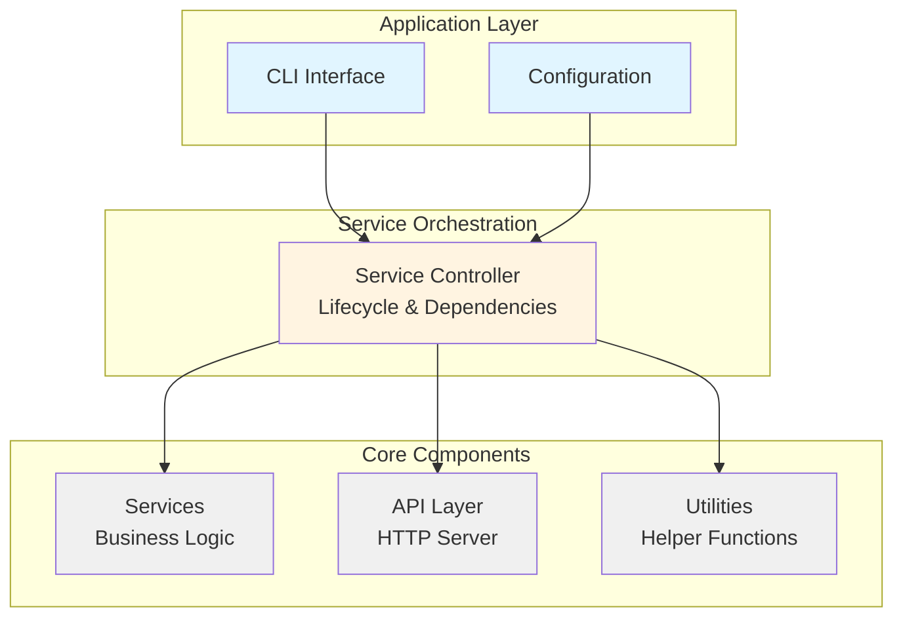
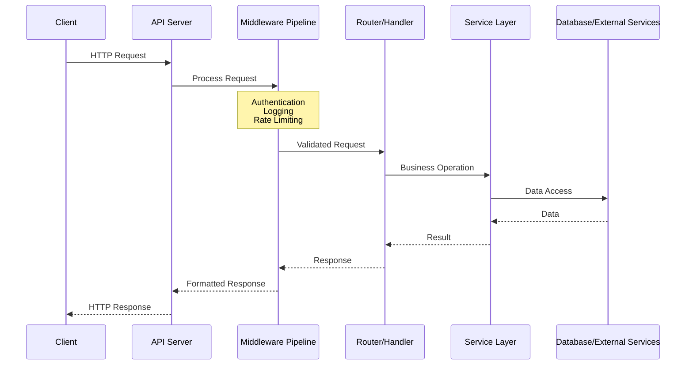

# Framingo

[](LICENSE)
[](https://go.dev/)

**Framingo** is a modular, service-oriented Go framework for building production-ready HTTP API applications. It provides a comprehensive set of tools, utilities, and architectural patterns to help you quickly develop scalable, maintainable backend services.

## Features

- **Service-Oriented Architecture** - Built-in service lifecycle management with automatic dependency resolution

- **HTTP API Server** - Production-ready API server with routing, middleware, and rate limiting

- **Rich Utilities** - Extensive collection of utility packages for common operations

- **Modular Design** - Pick and choose components based on your needs

- **Configuration Management** - YAML-based configuration with environment variable overrides

- **Database Integration** - Database manager with connection pooling and migrations

- **CLI Support** - Built-in command-line interface framework integration

- **Production Ready** - Error handling, logging, graceful shutdown, and profiling support

## Table of Contents

- [Quick Start](#quick-start)
- [Architecture](#architecture)
- [Core Modules](#core-modules)
- [Building Your First Application](#building-your-first-application)
- [Documentation](#documentation)
- [Examples](#examples)
- [Contributing](#contributing)
- [License](#license)

## Quick Start

### Installation

```bash
go get github.com/xhanio/framingo
```

### Your First Application

Create a simple HTTP API server in minutes:

```go
// main.go
package main

import (
    "github.com/xhanio/framingo/example/components/cmd/example"
)

func main() {
    rootCmd := example.NewRootCmd()
    rootCmd.Execute()
}
```

```yaml
# config.yaml
api:
  http:
    host: 0.0.0.0
    port: 8080
    prefix: /api/v1
```

```bash
# Run your application
go run main.go daemon -c config.yaml
```

**For a complete tutorial**, see the [Building Your First Application](#building-your-first-application) section below.

## Architecture

Framingo follows a layered architecture pattern:



### Request Flow



## Core Modules

Framingo provides several core modules organized under `pkg/`:

### Services (`pkg/services/`)

Production-ready service implementations:

- **API Server** (`api/server`) - HTTP API server with Echo framework
  - Route management and handler registration
  - Built-in middleware (error handling, logging, rate limiting)
  - Multiple server support with TLS
  - Request/response lifecycle management

- **API Client** (`api/client`) - HTTP client for making API requests

- **Controller** (`controller`) - Service lifecycle orchestration
  - Automatic dependency resolution via topological sort
  - Service registration and initialization
  - Graceful startup and shutdown

- **Database** (`db`) - Database management
  - Connection pooling
  - Migration support
  - Multiple database type support

- **Event Bus** (`eventbus`) - Publish-subscribe event system

- **Planner** (`planner`) - Task scheduling and planning

- **PubSub** (`pubsub`) - Message queue integration

- **Vector DB** (`vdb`) - Vector database support

### Types (`pkg/types/`)

Type definitions and interfaces:

- **API Types** (`api`) - HTTP API related types
  - Router, Middleware, Handler interfaces
  - Request/Response models
  - Error types

- **Common Types** (`common`) - Shared interfaces
  - Service, Daemon, Initializable interfaces
  - Context keys and constants

- **Info Types** (`info`) - Build and version information

### Utilities (`pkg/utils/`)

Comprehensive utility packages:

- **certutil** - Certificate and TLS utilities
- **cmdutil** - Command execution helpers
- **ioutil** - I/O operations
- **job** - Job execution framework
- **log** - Structured logging with rotation
- **maputil** - Map operations
- **netutil** - Network utilities
- **pathutil** - Path operations
- **printutil** - Pretty printing
- **reflectutil** - Reflection helpers
- **sliceutil** - Slice operations
- **strutil** - String utilities
- **task** - Task management
- **timeutil** - Time operations

### Data Structures (`pkg/structs/`)

Efficient data structures:

- **buffer** - Circular buffers
- **graph** - Graph data structures
- **lease** - Lease management
- **queue** - Queue implementations
- **staque** - Stack and queue hybrid
- **trie** - Trie data structure

## Building Your First Application

### Step 1: Project Setup

```bash
# Create your project
mkdir myapp && cd myapp
go mod init github.com/yourorg/myapp

# Get Framingo
go get github.com/xhanio/framingo
```

### Step 2: Define Your Service

```go
// services/hello/model.go
package hello

import (
    "context"
    "github.com/xhanio/framingo/pkg/types/common"
)

type Manager interface {
    common.Service
    common.Initializable
    common.Daemon
    SayHello(ctx context.Context, name string) (string, error)
}
```

```go
// services/hello/manager.go
package hello

import (
    "context"
    "fmt"
    "github.com/xhanio/framingo/pkg/utils/log"
)

type manager struct {
    log log.Logger
}

func New(logger log.Logger) Manager {
    return &manager{log: logger}
}

func (m *manager) Name() string { return "hello-service" }
func (m *manager) Dependencies() []common.Service { return nil }
func (m *manager) Init() error { return nil }
func (m *manager) Start(ctx context.Context) error { return nil }
func (m *manager) Stop(wait bool) error { return nil }

func (m *manager) SayHello(ctx context.Context, name string) (string, error) {
    m.log.Infof("Saying hello to %s", name)
    return fmt.Sprintf("Hello, %s!", name), nil
}
```

### Step 3: Create HTTP Router

```go
// routers/hello/router.go
package hello

import (
    "github.com/labstack/echo/v4"
    "github.com/xhanio/framingo/pkg/types/api"
    "myapp/services/hello"
)

type router struct {
    helloSvc hello.Manager
}

func New(svc hello.Manager) api.Router {
    return &router{helloSvc: svc}
}

func (r *router) Name() string { return "hello-router" }
func (r *router) Dependencies() []common.Service { return []common.Service{r.helloSvc} }
func (r *router) Config() []byte { return config }

func (r *router) Handlers() map[string]echo.HandlerFunc {
    return map[string]echo.HandlerFunc{
        "Hello": r.Hello,
    }
}

func (r *router) Hello(c echo.Context) error {
    name := c.QueryParam("name")
    if name == "" {
        name = "World"
    }

    msg, err := r.helloSvc.SayHello(c.Request().Context(), name)
    if err != nil {
        return err
    }

    return c.JSON(200, map[string]string{"message": msg})
}
```

```yaml
# routers/hello/router.yaml (embedded in router.go)
server: http
prefix: /hello
handlers:
  - method: GET
    path: /
    func: Hello
```

### Step 4: Wire It All Together

```go
// cmd/myapp/main.go
package main

import (
    "context"
    "os"

    "github.com/spf13/cobra"
    "github.com/xhanio/framingo/pkg/services/api/server"
    "github.com/xhanio/framingo/pkg/services/controller"
    "github.com/xhanio/framingo/pkg/utils/log"

    "myapp/services/hello"
    "myapp/routers/hello"
)

func main() {
    rootCmd := &cobra.Command{Use: "myapp"}

    daemonCmd := &cobra.Command{
        Use: "daemon",
        RunE: func(cmd *cobra.Command, args []string) error {
            // Initialize logger
            logger := log.New()

            // Create services
            helloSvc := hello.New(logger)

            // Create API server
            apiSrv := server.New(server.WithLogger(logger))
            apiSrv.Add("http", server.WithEndpoint("0.0.0.0", 8080, "/api/v1"))

            // Register router
            apiSrv.RegisterRouters(helloRouter.New(helloSvc))

            // Create service controller
            ctrl := controller.New(controller.WithLogger(logger))
            ctrl.Register(helloSvc, apiSrv)

            // Initialize and start
            if err := ctrl.Init(); err != nil {
                return err
            }
            return ctrl.Start(context.Background())
        },
    }

    rootCmd.AddCommand(daemonCmd)
    if err := rootCmd.Execute(); err != nil {
        os.Exit(1)
    }
}
```

### Step 5: Run and Test

```bash
# Run your application
go run cmd/myapp/main.go daemon

# Test the endpoint
curl http://localhost:8080/api/v1/hello?name=Framingo
# Response: {"message": "Hello, Framingo!"}
```

## Documentation

### Comprehensive Guides

- **[Complete Application Guide](example/README.md)** - Full tutorial with all components
- **[Service Layer](example/services/README.md)** - Building business logic services
- **[HTTP Routers](example/routers/README.md)** - Creating API endpoints
- **[Middleware](example/middlewares/README.md)** - Request processing pipeline
- **[Server Component](example/components/server/README.md)** - Application orchestration
- **[CLI Component](example/components/cmd/README.md)** - Command-line interface

### API Reference

Each package contains detailed documentation:

```bash
# View package documentation
go doc github.com/xhanio/framingo/pkg/services/api/server
go doc github.com/xhanio/framingo/pkg/utils/log
```

## Examples

The `example/` directory contains a complete, production-ready application demonstrating all framework features:

```
example/
+-- components/
|   +-- cmd/example/        # CLI with Cobra
|   +-- server/example/     # Server orchestration
+-- services/example/       # Business service
+-- routers/example/        # HTTP routes
+-- middlewares/example/    # Custom middleware
+-- types/                  # Type definitions
|   +-- entity/             # Business entities
+-- utils/                  # Utility modules
    +-- infra/              # Infrastructure utilities
```

### Running the Example

```bash
# Clone the repository
git clone https://github.com/xhanio/framingo.git
cd framingo

# Create a config file
cat > config.yaml <<EOF
log:
  level: 0
api:
  http:
    host: 0.0.0.0
    port: 8080
    prefix: /api/v1
EOF

# Run the example (requires implementing main.go)
# See example/README.md for complete setup
```

### Example Features Demonstrated

- ✅ Service lifecycle management
- ✅ HTTP API with routing
- ✅ Custom middleware (deflate compression)
- ✅ YAML-based configuration
- ✅ CLI with multiple commands
- ✅ Graceful shutdown
- ✅ Signal handling
- ✅ Structured logging
- ✅ Service dependencies
- ✅ Multiple API servers

## Key Concepts

### Service Lifecycle

All services implement a standard lifecycle:

```go
type Service interface {
    Name() string
    Dependencies() []common.Service
}

type Initializable interface {
    Init() error
}

type Daemon interface {
    Start(context.Context) error
    Stop(wait bool) error
}
```

### Dependency Management

Services declare their dependencies, and the controller automatically resolves the startup order:

```go
func (s *myService) Dependencies() []common.Service {
    return []common.Service{s.database, s.cache}
}

// Controller automatically starts: database -> cache -> myService
```

### Router Configuration

Routers use YAML configuration for declarative route definition:

```yaml
server: http
prefix: /api/users
handlers:
  - method: GET
    path: /:id
    func: GetUser
  - method: POST
    path: /
    func: CreateUser
    middleware: auth
```

### Middleware Pipeline

Middlewares process requests in order:

```
Request -> Recover -> Info -> Throttle -> Logger -> Custom -> Handler -> Response
```

## Configuration

Framingo uses Viper for configuration management with priority:

1. **Command-line flags** (highest)
2. **Environment variables**
3. **YAML configuration file**
4. **Default values** (lowest)

```yaml
# config.yaml
log:
  level: 0  # 0=Debug, 1=Info, 2=Warn, 3=Error
  file: /var/log/app.log

db:
  type: postgres
  source:
    host: localhost
    port: 5432

api:
  http:
    host: 0.0.0.0
    port: 8080
    prefix: /api/v1
    throttle:
      rps: 100.0
      burst_size: 200
```

Environment variable override:
```bash
export FRAMINGO_API_HTTP_PORT=9090
```

## Production Deployment

### Docker

```dockerfile
FROM golang:1.21 AS builder
WORKDIR /app
COPY . .
RUN go build -o app cmd/app/main.go

FROM alpine:latest
COPY --from=builder /app/app /usr/local/bin/
COPY config.yaml /etc/app/
CMD ["app", "daemon", "-c", "/etc/app/config.yaml"]
```

### Kubernetes

```yaml
apiVersion: apps/v1
kind: Deployment
metadata:
  name: myapp
spec:
  replicas: 3
  template:
    spec:
      containers:
      - name: myapp
        image: myapp:latest
        ports:
        - containerPort: 8080
```

### Systemd

```ini
[Unit]
Description=My Framingo App

[Service]
ExecStart=/usr/local/bin/myapp daemon -c /etc/myapp/config.yaml
Restart=on-failure

[Install]
WantedBy=multi-user.target
```

## Best Practices

1. **Service Design**
   - Keep services focused and single-purpose
   - Declare dependencies explicitly
   - Use interfaces for testability

2. **Error Handling**
   - Use error wrapping for context
   - Return appropriate HTTP status codes
   - Log errors at service boundaries

3. **Configuration**
   - Use YAML for structure
   - Use env vars for secrets
   - Validate on startup

4. **Testing**
   - Test services independently
   - Mock dependencies
   - Integration tests for full flow

5. **Performance**
   - Enable connection pooling
   - Configure rate limiting
   - Use pprof for profiling

## Contributing

Contributions are welcome! Please feel free to submit a Pull Request.

1. Fork the repository
2. Create your feature branch (`git checkout -b feature/amazing-feature`)
3. Commit your changes (`git commit -m 'Add some amazing feature'`)
4. Push to the branch (`git push origin feature/amazing-feature`)
5. Open a Pull Request

## License

This project is licensed under the Apache License 2.0 - see the [LICENSE](LICENSE) file for details.

## Support

- [Full Documentation](example/README.md)
- [Issue Tracker](https://github.com/xhanio/framingo/issues)
- [Discussions](https://github.com/xhanio/framingo/discussions)

## Acknowledgments

Built with:
- [Echo](https://echo.labstack.com/) - High performance HTTP framework
- [Cobra](https://github.com/spf13/cobra) - CLI framework
- [Viper](https://github.com/spf13/viper) - Configuration management
- [GORM](https://gorm.io/) - ORM library

---

**Start building with Framingo today!**
