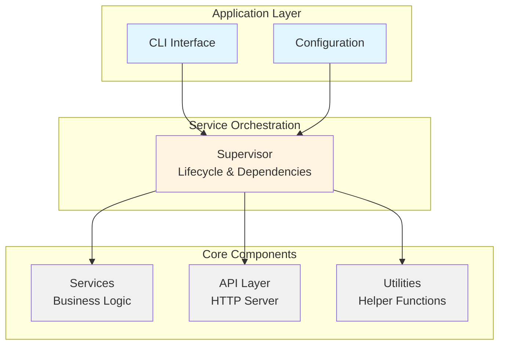
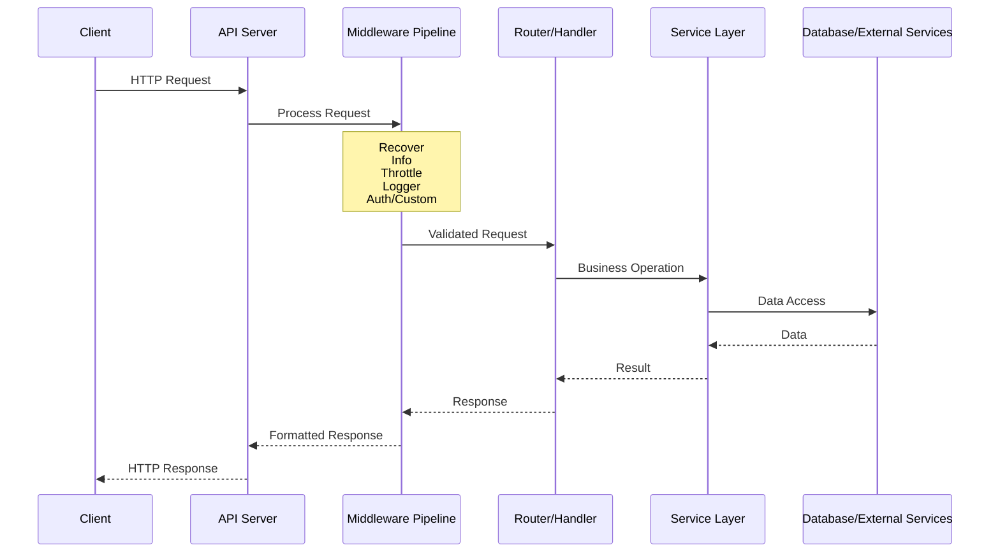

# Framingo

[](LICENSE)
[](https://go.dev/)

**Framingo** is a modular, service-oriented Go framework for building production-ready HTTP API applications. It provides service lifecycle management, dependency resolution, a declarative HTTP router, database integration, pub/sub messaging, and health monitoring — all wired together by a supervisor that handles graceful startup, shutdown, and automatic restart.

## Features

- **Service-Oriented Architecture** — Compose applications from small services with automatic dependency resolution via topological sort

- **Supervisor Lifecycle** — Centralized orchestration with init, start, stop, and per-service runtime restart

- **Health Monitoring** — Kubernetes-style liveness/readiness probes with automatic restart on liveness failure

- **HTTP API Server** — Echo-based server with declarative YAML routing, middleware pipeline, throttling, TLS, and WebSocket support

- **Database Integration** — GORM-backed manager for PostgreSQL, MySQL, SQLite, and ClickHouse with connection pooling, migrations, and context-aware transactions

- **Pub/Sub Messaging** — Hierarchical topic dispatch with pluggable Memory, Redis, and Kafka drivers, plus a higher-level message bus with WebSocket bridging

- **Task Planning** — Concurrent task scheduler with priority, retry, and result tracking

- **Instance-Based Configuration** — Viper instance propagated through `context.Context` (no global singletons), with hot-reload

- **Structured Logging** — Zap-based logger with file rotation and per-service scoping

- **Production Ready** — Built-in OS signal handling (SIGINT/SIGTERM/SIGUSR1/SIGUSR2), pprof profiling, graceful shutdown, and error categorization via `xhanio/errors`

## Table of Contents

- [Quick Start](#quick-start)
- [Architecture](#architecture)
- [Core Modules](#core-modules)
- [Building Your First Application](#building-your-first-application)
- [Documentation](#documentation)
- [Examples](#examples)
- [Key Concepts](#key-concepts)
- [Configuration](#configuration)
- [Production Deployment](#production-deployment)
- [Best Practices](#best-practices)
- [Contributing](#contributing)
- [License](#license)

## Quick Start

### Installation

```bash
go get github.com/xhanio/framingo
```

### Running the Bundled Example

The fastest path to a working server is the example app under [example/](example/), which uses [GoPro](https://github.com/xhanio/gopro) for builds.

```bash
go install github.com/xhanio/gopro@latest

cd example
gopro build binary -e local

./bin/exampleapp daemon -c env/local/config/exampleapp/config.yaml
```

In another terminal:

```bash
# Log in first — the helloworld endpoint is protected by authnuser middleware
./bin/examplecli -e http://localhost:8080 login            # default admin / admin

./bin/examplecli -e http://localhost:8080 helloworld "Hello"
# {"id":1,"message":"hello world!!! Hello","created_at":"...","updated_at":"..."}
```

See [example/QUICKSTART.md](example/QUICKSTART.md) for the full walkthrough.

## Architecture

Framingo follows a layered architecture pattern:


```mermaid
graph TB
    subgraph "Application Layer"
        CLI[CLI Interface]
        Config[Configuration]
    end

    subgraph "Service Orchestration"
        Sup[Supervisor<br/>Lifecycle &amp; Dependencies]
    end

    subgraph "Core Components"
        Services[Services<br/>Business Logic]
        API[API Layer<br/>HTTP Server]
        Utils[Utilities<br/>Helper Functions]
    end

    CLI --> Sup
    Config --> Sup
    Sup --> Services
    Sup --> API
    Sup --> Utils

    style CLI fill:#e1f5ff
    style Config fill:#e1f5ff
    style Sup fill:#fff4e1
    style Services fill:#f0f0f0
    style API fill:#f0f0f0
    style Utils fill:#f0f0f0
```

### Request Flow


```mermaid
sequenceDiagram
    participant Client
    participant APIServer as API Server
    participant Middleware as Middleware Pipeline
    participant Router as Router/Handler
    participant Service as Service Layer
    participant DB as Database/External Services

    Client->>APIServer: HTTP Request
    APIServer->>Middleware: Process Request
    Note over Middleware: Recover<br/>Info<br/>Throttle<br/>Logger<br/>Auth/Custom
    Middleware->>Router: Validated Request
    Router->>Service: Business Operation
    Service->>DB: Data Access
    DB-->>Service: Data
    Service-->>Router: Result
    Router-->>Middleware: Response
    Middleware-->>APIServer: Formatted Response
    APIServer-->>Client: HTTP Response
```

## Core Modules

Framingo is organized into four module categories under `pkg/`:

### Services (`pkg/services/`)

Production-ready service implementations:

- **[supervisor](pkg/services/supervisor/)** — Service lifecycle orchestration
  - Topologically sorts registered services by `Dependencies()`
  - Calls `Init(ctx)` and `Start(ctx)` in dependency order, `Stop()` in reverse
  - Monitors `Liveness`/`Readiness` probes and auto-restarts services that fail liveness
  - Per-service runtime control (`InitService`, `StartService`, `StopService`, `RestartService`)
  - Whole-graph `Restart(ctx)` and OS signal handling

- **[api/server](pkg/services/api/server/)** — HTTP API server
  - Multi-server support: `Add(name, WithEndpoint(...), WithTLS(...), WithThrottle(...))`
  - Declarative YAML routing via `api.Router`
  - Middleware pipeline with name-based resolution
  - WebSocket handlers (use method `WS` in router YAML)
  - Built-in middlewares: recover, info, throttle, logger, error

- **[api/client](pkg/services/api/client/)** — HTTP client with TLS, headers, cookies, body encoding (deflate), and structured error parsing — `NewRequest` builds, `Do` executes an `*http.Request`, `Send` does both in one shot

- **[db](pkg/services/db/)** — Database manager (GORM)
  - Pluggable drivers under [db/drivers/](pkg/services/db/drivers/): PostgreSQL, MySQL, SQLite, ClickHouse — blank-import only the ones your binary needs (a SQLite-only binary drops ~17MB)
  - Connection pooling (`WithConnection(maxOpen, maxIdle, maxLifetime, maxIdleTime)`)
  - Migrations via `WithMigration(dir, version)`
  - Context-aware queries: `FromContext(ctx)` auto-extracts an active transaction
  - `Transaction(ctx, fn, opts...)` wraps `fn` in a TX with rollback-on-error

- **[pubsub](pkg/services/pubsub/)** — Publish-subscribe primitive
  - Hierarchical topic subscriptions, non-self-delivery
  - Pluggable backends under [pubsub/driver/](pkg/services/pubsub/driver/): Memory, Redis, Kafka
  - `Publish(topic, msg)`, `Subscribe(topic, handler)`, `Unsubscribe(topic, handler)`
  - Per-subscriber queue absorbs bursts; a subscriber that stops draining is handled by
    `driver.WithOnFull(...)` — `DropMessage` (default, counted and logged) or `DropSubscriber`
    (close the channel so the peer reconnects). Drop and eviction counts show up in `Info`

- **[messagebus](pkg/services/messagebus/)** — Higher-level dispatch on top of `pubsub`
  - Single well-known topic with module-centric routing
  - Typed (`common.Message`) and raw (`kind`, payload) handlers
  - `NewMessenger()` for direct channel access, `AttachWebSocket()` to bridge a connection

- **[planner](pkg/services/planner/)** — Task scheduling
  - Concurrent execution with priority, cancel, and result lookup
  - Emits task lifecycle events through a `MessageSender`

### Types (`pkg/types/`)

Interface contracts and shared types:

- **[common](pkg/types/common/)** — Service lifecycle and utility interfaces
  - Lifecycle ([`service.go`](pkg/types/common/service.go)): `Service`, `Initializable`, `Daemon`, `Liveness`, `Readiness`, `Debuggable`
  - Utility ([`common.go`](pkg/types/common/common.go)): `Named`, `Unique`, `Weighted`
  - Messaging ([`message.go`](pkg/types/common/message.go)): `Message`, `MessageSender`, `RawMessageSender`, `MessageHandler`, `RawMessageHandler`
  - Context keys ([`context.go`](pkg/types/common/context.go)): `_config`, `_logger`, `_db`, `_tx`, `_credential`, `_session`, `_namespace`, `_trace`, `_api_request_info`, `_api_response_info`, `_api_error`

- **[api](pkg/types/api/)** — HTTP types: `Router`, `Middleware`, `Handler`, `HandlerGroup`, `HandlerKey`, `Endpoint`, `ThrottleConfig`, `TLS`

- **[model](pkg/types/model/)** — Behavioral contracts for framework services: `Supervisor`, `Database`, `Pubsub`, `MessageBus`, `Messenger`, `Planner`

- **[entity](pkg/types/entity/)** — Data carriers (POJOs) emitted by framework services: `SupervisorStats`, `Plan`, `PlannerStats`, `PubsubMessage`

- **[orm](pkg/types/orm/)** — Generic ORM base types: `Record[T]`, `Referenced[T]`, `Reference[T]`

- **[info](pkg/types/info/)** — Build metadata (product name, version, git tag/branch, build date) injected at link time

### Data Structures (`pkg/structs/`)

- **[buffer](pkg/structs/buffer/)** — Generic object pool and pooled read/write/seek buffer
- **[graph](pkg/structs/graph/)** — Topologically-sortable directed graph (used by the supervisor)
- **[lease](pkg/structs/lease/)** — Time-based lease manager with renewal hooks
- **[queue](pkg/structs/queue/)** — Double-buffered queue with auto-swap intervals
- **[staque](pkg/structs/staque/)** — Hybrid stack/queue with priority and blocking variants
- **[trie](pkg/structs/trie/)** — Prefix tree with fuzzy and prefix search (UTF-8 friendly)

### Utilities (`pkg/utils/`)

| Package | Purpose |
| --- | --- |
| **[certutil](pkg/utils/certutil/)** | X.509 CA/server/client cert generation and TLS config |
| **[cmdutil](pkg/utils/cmdutil/)** | Context-aware external command execution with I/O capture |
| **[confutil](pkg/utils/confutil/)** | Viper instance propagated via `context.Context` |
| **[envutil](pkg/utils/envutil/)** | Prefixed environment variable helpers |
| **[infra](pkg/utils/infra/)** | OS-level helpers (timezone detection and loading) |
| **[ioutil](pkg/utils/ioutil/)** | File copy/compress/encrypt with progress tracking and limits |
| **[job](pkg/utils/job/)** | Job model with state, labels, results, statistics |
| **[job/executor](pkg/utils/job/executor/)** | Executor with retry, timeout, cooldown, and stop control |
| **[log](pkg/utils/log/)** | Zap-based logger with file rotation, custom levels, per-service scoping |
| **[maputil](pkg/utils/maputil/)** | Map and set helpers (copy, diff, keys, membership) |
| **[netutil](pkg/utils/netutil/)** | MAC/CIDR/IP helpers |
| **[pageutil](pkg/utils/pageutil/)** | Pagination wrapper (items, total, params) |
| **[pathutil](pkg/utils/pathutil/)** | Path shortening |
| **[printutil](pkg/utils/printutil/)** | Console table formatting |
| **[reflectutil](pkg/utils/reflectutil/)** | Type location, byte conversion, field scan/apply |
| **[sliceutil](pkg/utils/sliceutil/)** | Membership, dedupe, diff, copy, change tracking |
| **[strutil](pkg/utils/strutil/)** | Validation, join, clean, random, hex format |
| **[task](pkg/utils/task/)** | Task manager with concurrency control and priority queue |
| **[testutil](pkg/utils/testutil/)** | Test database setup helpers |
| **[timeutil](pkg/utils/timeutil/)** | Timestamp comparison helpers |

## Building Your First Application

### Step 1: Project Setup

```bash
mkdir -p myapp/{cmd/myapp,pkg/{services,routers,middlewares,types/{api,entity,orm},components/{cmd,server},utils}}
cd myapp

go mod init github.com/yourorg/myapp
go get github.com/xhanio/framingo

# Resulting layout:
# myapp/
# ├── cmd/myapp/                # binary entry point
# ├── pkg/
# │   ├── components/
# │   │   ├── cmd/              # Cobra commands
# │   │   └── server/           # supervisor + wiring
# │   ├── services/             # business logic
# │   ├── routers/              # HTTP routes (router.go + router.yaml)
# │   ├── middlewares/          # api.Middleware implementations
# │   ├── types/{api,entity,orm}/
# │   └── utils/
# └── config.yaml
```

### Step 2: Define a Service

```go
// pkg/services/hello/model.go
package hello

import (
    "context"

    "github.com/xhanio/framingo/pkg/types/common"
)

type Manager interface {
    common.Service
    common.Initializable
    common.Daemon
    SayHello(ctx context.Context, name string) (string, error)
}
```

```go
// pkg/services/hello/manager.go
package hello

import (
    "context"
    "fmt"
    "path"

    "github.com/xhanio/framingo/pkg/types/common"
    "github.com/xhanio/framingo/pkg/utils/log"
    "github.com/xhanio/framingo/pkg/utils/reflectutil"
)

type manager struct {
    name string
    log  log.Logger
}

type Option func(*manager)

func WithLogger(logger log.Logger) Option {
    return func(m *manager) { m.log = logger }
}

func New(opts ...Option) Manager {
    m := &manager{log: log.Default}
    for _, opt := range opts {
        opt(m)
    }
    m.log = m.log.By(m)
    return m
}

func (m *manager) Name() string {
    if m.name == "" {
        m.name = path.Join(reflectutil.Locate(m))
    }
    return m.name
}

func (m *manager) Dependencies() []common.Service { return nil }
func (m *manager) Init(ctx context.Context) error { return nil }
func (m *manager) Start(ctx context.Context) error { return nil }
func (m *manager) Stop(wait bool) error            { return nil }

func (m *manager) SayHello(ctx context.Context, name string) (string, error) {
    m.log.Infof("saying hello to %s", name)
    return fmt.Sprintf("Hello, %s!", name), nil
}
```

### Step 3: Create an HTTP Router

**Recommended handler signature**: `func(c api.Context) error`, where `api.Context` is a project-defined interface that embeds `echo.Context` (see [`example/pkg/types/api/api.go`](example/pkg/types/api/api.go) for the canonical wrapper). This signature gives you a single context value that satisfies both `echo.Context` and `context.Context`, plus a natural home for project-wide helpers (credential, session, trace-id, custom binders) without touching every call site later.

You can still register raw `echo.HandlerFunc` if you prefer; the framework accepts both. But for new projects, prefer `api.Context` so the door is open for future extension.

The example project splits each router into two files — `router.go` for wiring (config, dependencies, `Handlers()`) and `handler.go` for the handler method bodies. Within the package, files share the same `import` aliases by convention: the framework `api` package is aliased as `fapi`, and the project's `api.Context` wrapper is imported unaliased as `api`.

```go
// pkg/routers/hello/router.go
package hello

import (
    _ "embed"

    fapi "github.com/xhanio/framingo/pkg/types/api"
    "github.com/xhanio/framingo/pkg/types/common"
    "github.com/xhanio/framingo/pkg/utils/log"

    "github.com/yourorg/myapp/pkg/services/hello"
    "github.com/yourorg/myapp/pkg/types/api"
)

//go:embed router.yaml
var config []byte

type router struct {
    log      log.Logger
    helloSvc hello.Manager
}

func New(svc hello.Manager, log log.Logger) fapi.Router {
    return &router{helloSvc: svc, log: log}
}

func (r *router) Name() string                    { return "hello-router" }
func (r *router) Dependencies() []common.Service  { return []common.Service{r.helloSvc} }
func (r *router) Config() []byte                  { return config }

// DiscoverHandlers reflects over r's methods and wraps any
// `func(api.Context) error` into an echo.HandlerFunc automatically.
// The debug log makes route registration visible during startup.
func (r *router) Handlers() map[string]any {
    handlers := api.DiscoverHandlers(r)
    r.log.Debugf("router %s parsed %d handler(s)", r.Name(), len(handlers))
    return handlers
}
```

```go
// pkg/routers/hello/handler.go
package hello

import (
    "net/http"

    "github.com/yourorg/myapp/pkg/types/api"
)

func (r *router) Hello(c api.Context) error {
    name := c.QueryParam("name")
    if name == "" {
        name = "World"
    }
    msg, err := r.helloSvc.SayHello(c, name) // c is also a context.Context
    if err != nil {
        return err
    }
    return c.JSON(http.StatusOK, map[string]string{"message": msg})
}
```

```yaml
# pkg/routers/hello/router.yaml
server: http
prefix: /hello
handlers:
  - method: GET
    path: /
    func: Hello
```

### Step 4: Wire It Together

```go
// pkg/components/server/myapp/manager.go
package myapp

import (
    "context"

    "github.com/spf13/viper"

    "github.com/xhanio/framingo/pkg/services/api/server"
    "github.com/xhanio/framingo/pkg/services/supervisor"
    "github.com/xhanio/framingo/pkg/types/common"
    "github.com/xhanio/framingo/pkg/utils/log"

    helloRouter "github.com/yourorg/myapp/pkg/routers/hello"
    "github.com/yourorg/myapp/pkg/services/hello"
)

type Manager interface {
    common.Daemon
    Init(ctx context.Context) error
}

type manager struct {
    config   *viper.Viper
    log      log.Logger
    services supervisor.Manager
    api      server.Manager
    helloSvc hello.Manager
}

func New(config *viper.Viper) Manager {
    return &manager{config: config}
}

func (m *manager) Init(ctx context.Context) error {
    m.log = log.New(log.WithLevel(m.config.GetInt("log.level")))
    m.services = supervisor.New(m.config, supervisor.WithLogger(m.log))

    m.api = server.New(server.WithLogger(m.log))
    if httpConfig := m.config.Sub("api.http"); httpConfig != nil {
        m.api.Add("http",
            server.WithEndpoint(
                httpConfig.GetString("host"),
                httpConfig.GetInt("port"),
                httpConfig.GetString("prefix"),
            ),
        )
    }

    m.helloSvc = hello.New(hello.WithLogger(m.log))
    m.services.Register(m.helloSvc)

    if err := m.services.TopoSort(); err != nil {
        return err
    }

    m.services.Register(m.api)

    if err := m.services.Init(ctx); err != nil {
        return err
    }

    return m.api.RegisterRouters(helloRouter.New(m.helloSvc))
}

func (m *manager) Start(ctx context.Context) error { return m.services.Start(ctx) }
func (m *manager) Stop(wait bool) error            { return m.services.Stop(wait) }
```

```go
// cmd/myapp/main.go
package main

import (
    "fmt"
    "os"

    "github.com/spf13/cobra"
    "github.com/spf13/viper"

    "github.com/yourorg/myapp/pkg/components/server/myapp"
)

func main() {
    var configFile string

    rootCmd := &cobra.Command{Use: "myapp"}

    daemonCmd := &cobra.Command{
        Use: "daemon",
        RunE: func(cmd *cobra.Command, args []string) error {
            config := viper.New()
            config.SetConfigFile(configFile)
            config.SetEnvPrefix("MYAPP")
            config.AutomaticEnv()
            if err := config.ReadInConfig(); err != nil {
                return fmt.Errorf("read config: %w", err)
            }
            config.WatchConfig()

            mgr := myapp.New(config)
            if err := mgr.Init(cmd.Context()); err != nil {
                return err
            }
            return mgr.Start(cmd.Context())
        },
    }
    daemonCmd.Flags().StringVarP(&configFile, "config", "c", "config.yaml", "config file path")

    rootCmd.AddCommand(daemonCmd)
    if err := rootCmd.Execute(); err != nil {
        fmt.Fprintf(os.Stderr, "Error: %v\n", err)
        os.Exit(1)
    }
}
```

### Step 5: Run and Test

```bash
go build -o myapp cmd/myapp/main.go
./myapp daemon -c config.yaml

curl 'http://localhost:8080/api/v1/hello?name=Framingo'
# {"message":"Hello, Framingo!"}
```

## Documentation

- **[example/QUICKSTART.md](example/QUICKSTART.md)** — Build, run, and exercise the bundled example with GoPro
- **[example/](example/)** — Full reference application (supervisor, db, pubsub, messagebus, RBAC, CLI client)
- **Framework packages**:
  - **[pkg/services/](pkg/services/)** — supervisor, api server/client, db, pubsub, messagebus, planner
  - **[pkg/types/](pkg/types/)** — common, api, model, entity, orm, info
  - **[pkg/utils/](pkg/utils/)** — log, infra, and the utility packages listed above
  - **[pkg/structs/](pkg/structs/)** — graph, queue, buffer, trie, lease, staque

View package docs locally:

```bash
go doc github.com/xhanio/framingo/pkg/services/supervisor
go doc github.com/xhanio/framingo/pkg/services/api/server
go doc github.com/xhanio/framingo/pkg/services/messagebus
```

## Examples

The [example/](example/) directory contains a production-shaped reference app demonstrating most framework features:

```
example/
├── pkg/
│   ├── components/
│   │   ├── cmd/
│   │   │   ├── app/                 # daemon CLI (daemon, version)
│   │   │   └── cli/                 # client CLI (login, helloworld, certutil)
│   │   ├── server/example/          # supervisor wiring for the daemon
│   │   └── client/example/          # HTTP client SDK
│   ├── services/
│   │   ├── example/                 # business service (HelloWorld)
│   │   ├── repository/              # GORM repositories per domain
│   │   └── system/                  # auth, user, role, organization, certificate
│   ├── routers/                     # auth, certificate, example, messagebus, role, user
│   ├── middlewares/                 # authnagent, authnuser, authz, deflate, feature
│   └── types/                       # api, entity, model, orm, message, rbac, preset, repo, infra
├── build/                           # GoPro build templates (binary, image)
├── env/local/                       # local-env config, docker-compose, kubernetes
├── dist/                            # generated outputs (configs, migrations, manifests)
└── QUICKSTART.md
```

Build it via GoPro:

```bash
cd example
gopro build binary -e local             # cgo-enabled local build
# gopro build binary -e prod            # static binary for production
# gopro build image -e local            # docker image

./bin/exampleapp daemon -c env/local/config/exampleapp/config.yaml
```

### Features Demonstrated

- Supervisor-orchestrated lifecycle with topological dependency resolution
- Multiple services: database, pubsub, message bus, RBAC, business logic
- HTTP routes with YAML configuration, middlewares (auth, deflate, feature flags), and a WebSocket endpoint via the message-bus router
- Type separation: `api/` (DTOs), `entity/` (domain), `orm/` (database), `model/` (interfaces)
- Database migrations and pluggable PostgreSQL/MySQL/SQLite/ClickHouse driver subpackages (blank-imported in [example/pkg/components/server/example/service.go](example/pkg/components/server/example/service.go))
- Pub/sub with pluggable Memory/Redis/Kafka backends
- CLI client with credential persistence and certificate helpers
- GoPro-driven build, image, and Kubernetes manifest generation

## Key Concepts

### Service Lifecycle Interfaces

```go
type Service interface {
    Named                          // Name() string
    Dependencies() []Service       // startup ordering
}

type Initializable interface { Init(ctx context.Context) error }       // setup; called on start AND restart
type Daemon        interface { Start(ctx context.Context) error; Stop(wait bool) error }
type Liveness      interface { Alive() error }                         // failure triggers auto-restart
type Readiness     interface { Ready() error }                         // failure reported but not actioned
type Debuggable    interface { Info(w io.Writer, debug bool) }
```

Compose only the interfaces a service needs. The supervisor inspects each registered service at runtime to determine which lifecycle hooks to invoke.

### Type Separation

```go
// api — wire format with validation
type CreateUserRequest struct {
    Username string `json:"username" validate:"required"`
    Email    string `json:"email"    validate:"required,email"`
}

// entity — pure domain model
type User struct {
    ID       int64
    Username string
    Email    string
}

// orm — persistence model
type User struct {
    ID       int64  `gorm:"primaryKey"`
    Username string `gorm:"type:varchar(100);not null"`
    Email    string `gorm:"type:varchar(255);not null"`
}

func (User) TableName() string { return "users" }
```

The service layer converts between representations, keeping API contracts independent of storage and business logic independent of either.

### Dependency Management

Required dependencies become constructor arguments; optional config flows through functional options. The supervisor uses `Dependencies()` to topologically sort startup and shutdown.

```go
func New(database db.Manager, opts ...Option) Manager {
    m := &manager{db: database}
    for _, opt := range opts {
        opt(m)
    }
    return m
}

func (s *myService) Dependencies() []common.Service {
    return []common.Service{s.database}
}
```

### Router Configuration

```yaml
server: http
prefix: /users
handlers:
  - method: GET
    path: /:id
    func: GetUser
  - method: POST
    path: /
    func: CreateUser
    middlewares: [authnuser]
  - method: WS
    path: /events
    func: Events
```

Each router embeds its `router.yaml` and exposes a `Handlers() map[string]any` that maps each `func:` key to a handler implementation. The framework accepts `echo.HandlerFunc` (or `func(echo.Context) error`) for HTTP and `func(echo.Context, *websocket.Conn) error` for WebSocket — but the **recommended** pattern is `func(c api.Context) error` (and `func(c api.Context, conn *websocket.Conn) error` for WS), where `api.Context` is a project-defined interface that embeds `echo.Context` and `context.Context`. A small `DiscoverHandlers` helper (see [`example/pkg/types/api/api.go`](example/pkg/types/api/api.go)) reflects over the router's methods and wraps the project-context signature into the echo signature the server expects. This keeps handlers free to evolve (extra binders, session/credential accessors, trace propagation) without rewriting every signature.

The conventional file layout splits each router into `router.go` (factory + `Name`/`Dependencies`/`Config`/`Handlers`) and `handler.go` (the handler method bodies). The standard `Handlers()` implementation just delegates and emits a debug log so route registration is visible at startup:

```go
func (r *router) Handlers() map[string]any {
    handlers := api.DiscoverHandlers(r)
    r.log.Debugf("router %s parsed %d handler(s)", r.Name(), len(handlers))
    return handlers
}
```

### Middleware Pipeline

```
Request → Recover → Info → Throttle → Logger → custom (auth, deflate, …) → Handler → Response
```

Middlewares are resolved by name from the set registered with `srv.RegisterMiddlewares(...)`. Always register middlewares before routers.

### Error Handling

Use [`github.com/xhanio/errors`](https://github.com/xhanio/errors) exclusively. The API server's error handler routes by error category to set the HTTP status.

```go
return errors.NotFound.Newf("user %s not found", id)
if err := s.db.FromContext(ctx).Create(u).Error; err != nil {
    return errors.Wrapf(err, "create user %s", u.Name)
}
```

## Configuration

Framingo uses an **instance-based** Viper (not the global singleton) propagated through `context.Context`. Services read live config in `Init(ctx)` via `confutil.FromContext(ctx)`.

Priority (high → low):

1. Command-line flags
2. Environment variables
3. YAML configuration file
4. Default values

```yaml
# config.yaml
log:
  level: -1               # -1=Debug, 0=Info, 1=Warn, 2=Error
  file: /var/log/app.log
  rotation:
    max_size: 100         # MB
    max_backups: 3
    max_age: 7            # days

db:
  type: postgres          # postgres | mysql | sqlite | clickhouse
  source:
    host: localhost
    port: 5432
    user: app
    password: secret
    dbname: app
  migration:
    dir: ./migrations
    version: 0            # 0 = latest
  connection:
    max_open: 10
    max_idle: 5
    max_lifetime: 1h
    exec_timeout: 30s

api:
  http:
    host: 0.0.0.0
    port: 8080
    prefix: /api/v1
    throttle:
      rps: 100.0
      burst_size: 200

pprof:
  port: 6060              # optional
```

Override at runtime:

```bash
export MYAPP_API_HTTP_PORT=9090
./myapp daemon -c config.yaml
```

## Production Deployment

### Docker

```dockerfile
FROM golang:1.24 AS builder
WORKDIR /app
COPY . .
RUN go build -o app cmd/app/main.go

FROM alpine:latest
COPY --from=builder /app/app /usr/local/bin/
COPY config.yaml /etc/app/
CMD ["app", "daemon", "-c", "/etc/app/config.yaml"]
```

### Kubernetes

The example ships generated manifests at [example/env/local/kubernetes/exampleapp/](example/env/local/kubernetes/exampleapp/) (`deployment.yaml`, `service.yaml`, `configmap.yaml`). Use `gopro generate kubernetes` to regenerate for your environment.

### Systemd

```ini
[Unit]
Description=My Framingo App

[Service]
ExecStart=/usr/local/bin/myapp daemon -c /etc/myapp/config.yaml
Restart=on-failure

[Install]
WantedBy=multi-user.target
```

## Best Practices

1. **Architecture & Types**
   - Separate `api/`, `entity/`, `orm/` and convert between them in the service layer
   - Pass required dependencies as constructor arguments, optional config as `Option`s
   - Keep business logic independent of HTTP and persistence

2. **Service Design**
   - One `Manager` interface per service in a dedicated package
   - Use an **unexported struct** and **exported interface + factory** — strict convention throughout the framework
   - Declare dependencies explicitly via `Dependencies()`; the supervisor handles ordering
   - Read dynamic config in `Init(ctx)` via `confutil.FromContext(ctx)` so restarts pick it up

3. **Error Handling**
   - Always use `github.com/xhanio/errors` — never `fmt.Errorf` or stdlib `errors`
   - Always wrap with `errors.Wrap`/`errors.Wrapf` instead of returning raw `err`
   - Pick the category (`NotFound`, `BadRequest`, `Internal`, …) that should map to the HTTP status

4. **Configuration**
   - Use YAML for hierarchy; env vars for secrets and per-environment overrides
   - Never reach for `viper.GetXxx` globals; take the instance from context

5. **Testing**
   - Mock collaborators through the `Manager` interface
   - Use `testutil` to spin up an isolated DB for integration tests
   - Test ORM ↔ entity conversions explicitly

6. **Performance**
   - Tune `db.connection.*` for your workload
   - Apply throttling per server (`WithThrottle`) or per handler in `router.yaml`
   - Enable pprof during incidents (`pprof.port`)

## Contributing

Contributions are welcome.

1. Fork the repository
2. Create your feature branch (`git checkout -b feature/amazing-feature`)
3. Commit your changes (`git commit -m 'Add amazing feature'`)
4. Push to the branch (`git push origin feature/amazing-feature`)
5. Open a Pull Request

## License

Apache License 2.0 — see [LICENSE](LICENSE).

## Resources & Support

- **[example/QUICKSTART.md](example/QUICKSTART.md)** — build & run the bundled example
- **[example/](example/)** — reference implementations
- **[Issues](https://github.com/xhanio/framingo/issues)** — bug reports and feature requests
- **[Discussions](https://github.com/xhanio/framingo/discussions)** — questions and community

## Acknowledgments

Built with:

- [Echo](https://echo.labstack.com/) — HTTP framework
- [Cobra](https://github.com/spf13/cobra) — CLI framework
- [Viper](https://github.com/spf13/viper) — configuration management
- [GORM](https://gorm.io/) — ORM
- [zap](https://github.com/uber-go/zap) — structured logging
- [xhanio/errors](https://github.com/xhanio/errors) — categorized error handling

---

**Start building with Framingo today!**
