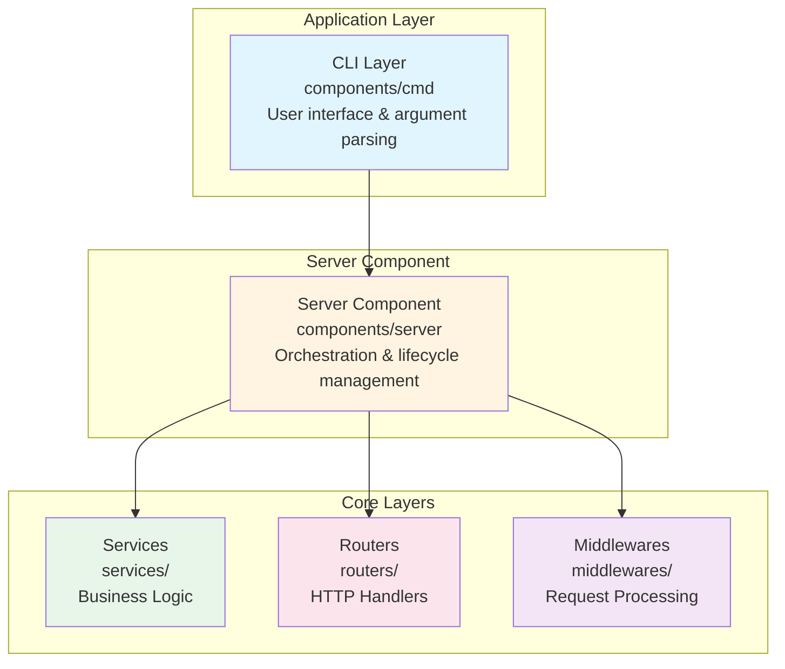
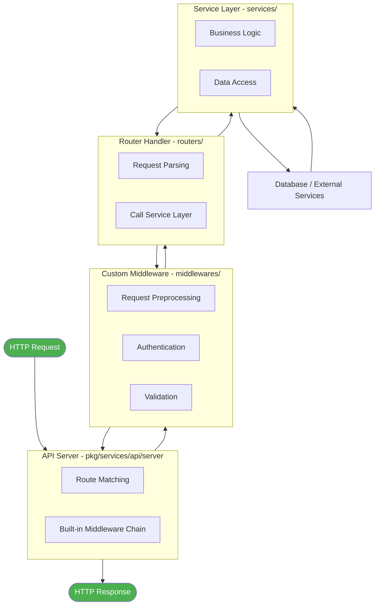

# Building Applications with Framingo

This directory contains a complete example application demonstrating how to build production-ready HTTP API services using the Framingo framework. This guide walks you through all components and shows how they work together.

## Table of Contents

- [Overview](#overview)
- [Project Structure](#project-structure)
- [Framework Modules](#framework-modules)
- [Quick Start](#quick-start)
- [Architecture](#architecture)
- [Building Your Application](#building-your-application)
- [Component Reference](#component-reference)
- [Development Workflow](#development-workflow)
- [Production Deployment](#production-deployment)

## Overview

The Framingo framework provides a modular, service-oriented architecture for building scalable HTTP APIs. This example demonstrates:

- **Service Layer**: Business logic with lifecycle management
- **HTTP API Layer**: RESTful endpoints with routing and middleware
- **Command Layer**: CLI interface for application control
- **Configuration Management**: YAML-based config with environment variable overrides
- **Dependency Management**: Automatic service dependency resolution

## Project Structure

When building a new Framingo application, organize your code into these key directories:

```
example/
+-- pkg/                # Application packages
|   +-- components/     # Application components (CLI & server orchestration)
|   |   +-- cmd/        # CLI interface using Cobra - entry point and command definitions
|   |   |   +-- example/    # Command implementations (daemon, version, etc.)
|   |   +-- server/     # Server component - wires services, routers, and middlewares together
|   |       +-- example/    # Server orchestration and lifecycle management
|   +-- services/       # Business logic layer - core application functionality
|   |   +-- example/    # Example: domain services with Init/Start/Stop lifecycle
|   +-- routers/        # HTTP routing layer - API endpoint handlers
|   |   +-- example/    # Example: request handlers mapped to routes via YAML config
|   +-- middlewares/    # HTTP middleware layer - request/response processing
|   |   +-- example/    # Example: authentication, compression, validation, etc.
|   +-- types/          # Type definitions - data models and interfaces
|   |   +-- api/        # API request/response types with validation
|   |   +-- entity/     # Business entities (pure domain models)
|   |   +-- orm/        # ORM models for database operations
|   +-- utils/          # Utility modules - helper functions and infrastructure
|       +-- infra/      # Infrastructure utilities (signals, profiling, etc.)
+-- README.md           # This file
```

**Key Directory Purposes:**

- **`components/`** - Application entry points and orchestration. The `cmd/` provides CLI interface, while `server/` initializes and manages all services.
- **`services/`** - Your business logic lives here. Services have lifecycle management (Init/Start/Stop) and dependency injection.
- **`routers/`** - Define HTTP endpoints and handlers. Each router maps routes to handler functions via YAML configuration.
- **`middlewares/`** - Process requests before they reach handlers (auth, validation, logging, compression, etc.).
- **`types/`** - Shared data structures separated by purpose: `api/` for request/response types, `entity/` for business models, `orm/` for database models.
- **`utils/`** - Reusable helper functions and infrastructure code that doesn't fit in services.

## Framework Modules

The Framingo framework is organized into four core module categories under the [pkg/](../pkg/) directory:

### Services (`pkg/services/`)

Production-ready service implementations that provide core functionality:

- **[api/server](../pkg/services/api/server/)** - HTTP API server with Echo framework integration, middleware support, and route management
- **[api/client](../pkg/services/api/client/)** - HTTP client utilities for making API requests
- **[controller](../pkg/services/controller/)** - Service lifecycle management with dependency resolution and topological sorting
- **[db](../pkg/services/db/)** - Database manager with GORM integration, connection pooling, and migration support
- **[planner](../pkg/services/planner/)** - Task scheduling and planning service
- **[pubsub](../pkg/services/pubsub/)** - Publish-subscribe messaging pattern implementation

### Data Structures (`pkg/structs/`)

Efficient, generic data structures for common algorithms:

- **[buffer](../pkg/structs/buffer/)** - Ring buffer implementation with fixed capacity
- **[graph](../pkg/structs/graph/)** - Generic graph structure with topological sort support
- **[lease](../pkg/structs/lease/)** - Time-based lease management for resource allocation
- **[queue](../pkg/structs/queue/)** - FIFO queue implementation
- **[staque](../pkg/structs/staque/)** - Hybrid stack/queue data structure
- **[trie](../pkg/structs/trie/)** - Prefix tree for efficient string matching

### Type Definitions (`pkg/types/`)

Core interfaces and type definitions used throughout the framework:

- **[common](../pkg/types/common/)** - Common interfaces (`Service`, `Daemon`, `Initializable`, `Named`, etc.)
- **[api](../pkg/types/api/)** - API-related types (middleware, router, handler interfaces)
- **[info](../pkg/types/info/)** - Application metadata (version, build info)

### Utilities (`pkg/utils/`)

Helper packages for common tasks:

- **[certutil](../pkg/utils/certutil/)** - Certificate and TLS utilities
- **[cmdutil](../pkg/utils/cmdutil/)** - Command-line utilities
- **[infra](../pkg/utils/infra/)** - Infrastructure helpers (signals, profiling)
- **[ioutil](../pkg/utils/ioutil/)** - I/O utilities
- **[job](../pkg/utils/job/)** - Background job management
- **[log](../pkg/utils/log/)** - Structured logging with zap integration
- **[maputil](../pkg/utils/maputil/)** - Map and set utilities
- **[netutil](../pkg/utils/netutil/)** - Network utilities
- **[pathutil](../pkg/utils/pathutil/)** - Path manipulation helpers
- **[printutil](../pkg/utils/printutil/)** - Pretty printing utilities
- **[reflectutil](../pkg/utils/reflectutil/)** - Reflection helpers
- **[sliceutil](../pkg/utils/sliceutil/)** - Slice manipulation utilities
- **[strutil](../pkg/utils/strutil/)** - String utilities
- **[task](../pkg/utils/task/)** - Task management utilities
- **[timeutil](../pkg/utils/timeutil/)** - Time-related utilities

These modules provide the foundation for building robust, scalable applications with Framingo. Most applications will primarily use the **services** layer while the other modules provide supporting functionality.

## Quick Start

### 1. Create Your Main Application

```go
// cmd/myapp/main.go
package main

import (
    "fmt"
    "os"

    "github.com/xhanio/framingo/example/pkg/components/cmd/example"
)

func main() {
    rootCmd := example.NewRootCmd()
    if err := rootCmd.Execute(); err != nil {
        fmt.Fprintf(os.Stderr, "Error: %v\n", err)
        os.Exit(1)
    }
}
```

### 2. Create Configuration File

```yaml
# config.yaml
log:
  level: 0  # Debug
  file: /var/log/myapp.log
  rotation:
    max_size: 100
    max_backups: 3
    max_age: 7

db:
  type: postgres
  source:
    host: 127.0.0.1
    port: 5432
    user: dbuser
    password: dbpass
    dbname: mydb
  connection:
    max_open: 10
    max_idle: 5
    max_lifetime: 1h

api:
  http:
    host: 0.0.0.0
    port: 8080
    prefix: /api/v1
    throttle:
      rps: 100.0
      burst_size: 200
```

### 3. Build and Run

```bash
# Build the application
go build -o myapp cmd/myapp/main.go

# Run the server
./myapp daemon -c config.yaml

# Check version
./myapp version
```

### 4. Test the API

```bash
# Test the example endpoint
curl -X GET "http://localhost:8080/api/v1/demo/example?message=Hello%20World"

# Response:
# {
#   "id": 1,
#   "message": "Hello World",
#   "created_at": "2024-01-15T10:30:00Z",
#   "updated_at": "2024-01-15T10:30:00Z"
# }
```

## Architecture

### Layer Overview



### Request Flow



## Building Your Application

### Step 1: Define Your Types

Framingo separates types by purpose for better architecture:

**API Types** (request/response with validation):
```go
// types/api/user.go
package api

type CreateUserRequest struct {
    Username string `json:"username" validate:"required"`
    Email    string `json:"email" validate:"required,email"`
}
```

**Entity Types** (pure business models):
```go
// types/entity/user.go
package entity

type User struct {
    ID       int64  `json:"id"`
    Username string `json:"username"`
    Email    string `json:"email"`
}
```

**ORM Types** (database models):
```go
// types/orm/user.go
package orm

type User struct {
    ID       int64  `gorm:"primaryKey"`
    Username string `gorm:"type:varchar(100);not null;unique"`
    Email    string `gorm:"type:varchar(255);not null"`
}

func (User) TableName() string {
    return "users"
}
```

See [pkg/types/README.md](pkg/types/README.md) for detailed explanation of type separation.

### Step 2: Create a Service

Services contain your business logic and implement lifecycle management. **Important**: Pass required dependencies as constructor arguments, not as options.

```go
// services/user/model.go
package user

import (
    "context"
    "github.com/xhanio/framingo/pkg/types/common"
    "github.com/xhanio/framingo/example/pkg/types/entity"
)

type Manager interface {
    common.Service
    common.Initializable
    common.Daemon
    GetUser(ctx context.Context, id int64) (*entity.User, error)
    CreateUser(ctx context.Context, username, email string) (*entity.User, error)
}
```

```go
// services/user/manager.go
package user

import (
    "github.com/xhanio/framingo/example/pkg/types/entity"
    "github.com/xhanio/framingo/example/pkg/types/orm"
    "github.com/xhanio/framingo/pkg/services/db"
)

type manager struct {
    log log.Logger
    db  db.Manager
}

// Required dependencies as constructor arguments
func New(database db.Manager, opts ...Option) Manager {
    m := &manager{db: database}
    for _, opt := range opts {
        opt(m)
    }
    return m
}

func (m *manager) CreateUser(ctx context.Context, username, email string) (*entity.User, error) {
    // Create ORM model for database
    ormUser := &orm.User{
        Username: username,
        Email:    email,
    }

    // Save to database
    if err := m.db.FromContext(ctx).Create(ormUser).Error; err != nil {
        return nil, errors.Wrap(err)
    }

    // Convert to entity for return
    return &entity.User{
        ID:       ormUser.ID,
        Username: ormUser.Username,
        Email:    ormUser.Email,
    }, nil
}
```

**Learn more:** [Service Documentation](pkg/services/README.md)

### Step 3: Create a Router

Routers define HTTP endpoints and handlers.

```go
// routers/user/router.yaml
server: http
prefix: /users
handlers:
  - method: GET
    path: /:id
    func: GetUser
  - method: POST
    path: /
    func: CreateUser
```

```go
// routers/user/handler.go
package user

import (
    "net/http"
    "strconv"

    "github.com/labstack/echo/v4"
    "github.com/xhanio/errors"
    "github.com/xhanio/framingo/example/pkg/services/user"
    "github.com/xhanio/framingo/example/pkg/types/api"
)

type router struct {
    userService user.Manager
}

func (r *router) GetUser(c echo.Context) error {
    id, err := strconv.ParseInt(c.Param("id"), 10, 64)
    if err != nil {
        return errors.BadRequest.Newf("invalid user id: %v", err)
    }

    user, err := r.userService.GetUser(c.Request().Context(), id)
    if err != nil {
        return errors.Wrap(err)
    }
    return c.JSON(http.StatusOK, user)
}

func (r *router) CreateUser(c echo.Context) error {
    // Parse and validate API request
    var req api.CreateUserRequest
    if err := c.Bind(&req); err != nil {
        return errors.BadRequest.Newf("invalid request: %v", err)
    }
    if err := c.Validate(&req); err != nil {
        return errors.Wrap(err)
    }

    // Call service (returns entity)
    user, err := r.userService.CreateUser(c.Request().Context(), req.Username, req.Email)
    if err != nil {
        return errors.Wrap(err)
    }

    return c.JSON(http.StatusCreated, user)
}
```

**Learn more:** [Router Documentation](pkg/routers/README.md)

### Step 4: Create Middleware (Optional)

Middlewares process requests before they reach handlers.

```go
// middlewares/auth/middleware.go
package auth

func (m *middleware) Func(next echo.HandlerFunc) echo.HandlerFunc {
    return func(c echo.Context) error {
        token := c.Request().Header.Get("Authorization")
        if !m.validateToken(token) {
            return errors.Unauthorized.New("invalid token")
        }
        return next(c)
    }
}
```

**Learn more:** [Middleware Documentation](pkg/middlewares/README.md)

### Step 5: Wire Everything Together

Update the server component to register your services, routers, and middlewares.

```go
// components/server/example/api.go
func (m *manager) initAPI() error {
    middlewares := []api.Middleware{
        authmw.New(),
    }

    routers := []api.Router{
        user.New(m.userService, m.log),
    }

    m.api.RegisterMiddlewares(middlewares...)
    return m.api.RegisterRouters(routers...)
}
```

```go
// components/server/example/manager.go - Init() method
func (m *manager) Init() error {
    // ... (logger, db setup)

    // Initialize your services (required dependencies as constructor args)
    m.userService = user.New(
        m.db,  // Required dependency
        user.WithLogger(m.log),  // Optional configuration
    )

    // Register services
    m.services.Register(
        m.db,
        m.userService,
    )

    // Resolve dependencies via topological sort
    if err := m.services.TopoSort(); err != nil {
        return errors.Wrap(err)
    }

    // Add API server (must be last)
    m.services.Register(m.api)

    // Initialize all services
    if err := m.services.Init(); err != nil {
        return err
    }

    // Initialize API components (register routers and middlewares)
    return m.initAPI()
}
```

**Learn more:** [Server Component Documentation](pkg/components/server/README.md)

### Step 6: Build and Deploy

```bash
# Build with version info
go build -ldflags="-X github.com/xhanio/framingo/pkg/types/info.Version=1.0.0" \
         -o myapp cmd/myapp/main.go

# Run
./myapp daemon -c config.yaml
```

**Learn more:** [CLI Documentation](pkg/components/cmd/README.md)

## Component Reference

### Services Layer

**Purpose**: Implement business logic with lifecycle management

**Key Features**:
- Dependency injection
- Lifecycle methods (Init, Start, Stop)
- Context-aware operations
- Automatic dependency resolution

**Documentation**: [pkg/services/README.md](pkg/services/README.md)

**Example**: [pkg/services/example/](pkg/services/example/)

### Routers Layer

**Purpose**: Define HTTP endpoints and handle requests

**Key Features**:
- YAML-based route configuration
- Automatic handler discovery via reflection
- Service dependency injection
- Echo framework integration

**Documentation**: [pkg/routers/README.md](pkg/routers/README.md)

**Example**: [pkg/routers/example/](pkg/routers/example/)

### Middlewares Layer

**Purpose**: Process HTTP requests before handlers

**Key Features**:
- Request/response modification
- Authentication and authorization
- Rate limiting (built-in)
- Error handling (built-in)

**Documentation**: [pkg/middlewares/README.md](pkg/middlewares/README.md)

**Example**: [pkg/middlewares/example/](pkg/middlewares/example/)

### Server Component

**Purpose**: Orchestrate all services and manage lifecycle

**Key Features**:
- Configuration management (Viper)
- Service dependency resolution
- Multiple API servers
- Graceful shutdown
- Signal handling
- pprof profiling

**Documentation**: [pkg/components/server/README.md](pkg/components/server/README.md)

**Example**: [pkg/components/server/example/](pkg/components/server/example/)

### CMD Component

**Purpose**: Provide CLI interface for the application

**Key Features**:
- Command-line argument parsing (Cobra)
- Multiple commands support
- Help generation
- Version information

**Documentation**: [pkg/components/cmd/README.md](pkg/components/cmd/README.md)

**Example**: [pkg/components/cmd/example/](pkg/components/cmd/example/)

## Development Workflow

### Project Setup

1. **Clone or create your project structure**:
```bash
mkdir -p myapp/{cmd/myapp,pkg/{services,routers,middlewares,types/entity,components/{cmd,server}}}
```

2. **Initialize Go module**:
```bash
cd myapp
go mod init github.com/yourorg/myapp
go get github.com/xhanio/framingo
```

3. **Copy example files as templates**:
```bash
# Use example files as starting point
cp -r $FRAMINGO_PATH/example/pkg/services/example myapp/pkg/services/myservice
# Modify as needed
```

### Development Cycle

1. **Define your types**:
   - API types (pkg/types/api/) - Request/response with validation
   - Entity types (pkg/types/entity/) - Business models
   - ORM types (pkg/types/orm/) - Database models
2. **Implement services** (pkg/services/) - Pass dependencies as constructor args
3. **Create routers** (pkg/routers/) - Bind API types, call services, return entities
4. **Add middlewares** if needed (pkg/middlewares/)
5. **Wire in server component** (pkg/components/server/)
6. **Test locally**:
```bash
go run cmd/myapp/main.go daemon -c config.yaml
```

### Testing

```bash
# Run tests
go test ./...

# Run with coverage
go test -cover ./...

# Run specific service tests
go test ./pkg/services/myservice/...
```

### Debugging

**Using pprof**:
```yaml
# config.yaml
pprof:
  port: 6060
```

```bash
# Start server
./myapp daemon -c config.yaml

# Access profiling
go tool pprof http://localhost:6060/debug/pprof/profile
```

**Using signals**:
```bash
# Print service info
kill -USR1 $(pgrep myapp)

# Print stack traces
kill -USR2 $(pgrep myapp)

# Graceful shutdown
kill -INT $(pgrep myapp)
```

## Production Deployment

### Build for Production

```bash
#!/bin/bash
VERSION=$(git describe --tags --always)
COMMIT=$(git rev-parse HEAD)
BUILD_TIME=$(date -u +%Y-%m-%dT%H:%M:%SZ)

go build -ldflags=" \
  -X github.com/xhanio/framingo/pkg/types/info.Version=${VERSION} \
  -X github.com/xhanio/framingo/pkg/types/info.Commit=${COMMIT} \
  -X github.com/xhanio/framingo/pkg/types/info.BuildTime=${BUILD_TIME}" \
  -o myapp cmd/myapp/main.go
```

### Docker Deployment

```dockerfile
# Dockerfile
FROM golang:1.21 AS builder
WORKDIR /app
COPY go.* ./
RUN go mod download
COPY . .
RUN CGO_ENABLED=0 GOOS=linux go build -o myapp cmd/myapp/main.go

FROM alpine:latest
RUN apk --no-cache add ca-certificates tzdata
WORKDIR /root/
COPY --from=builder /app/myapp .
COPY config.yaml .
EXPOSE 8080
CMD ["./myapp", "daemon", "-c", "config.yaml"]
```

```bash
# Build and run
docker build -t myapp:latest .
docker run -p 8080:8080 myapp:latest
```

### Kubernetes Deployment

```yaml
# deployment.yaml
apiVersion: apps/v1
kind: Deployment
metadata:
  name: myapp
spec:
  replicas: 3
  selector:
    matchLabels:
      app: myapp
  template:
    metadata:
      labels:
        app: myapp
    spec:
      containers:
      - name: myapp
        image: myapp:latest
        ports:
        - containerPort: 8080
        env:
        - name: FRAMINGO_DB_HOST
          valueFrom:
            secretKeyRef:
              name: db-secret
              key: host
        volumeMounts:
        - name: config
          mountPath: /etc/myapp
      volumes:
      - name: config
        configMap:
          name: myapp-config
```

### Systemd Service

```ini
# /etc/systemd/system/myapp.service
[Unit]
Description=My Framingo Application
After=network.target postgresql.service

[Service]
Type=simple
User=myapp
Group=myapp
WorkingDirectory=/opt/myapp
ExecStart=/opt/myapp/bin/myapp daemon -c /etc/myapp/config.yaml
Restart=on-failure
RestartSec=5s
StandardOutput=journal
StandardError=journal

[Install]
WantedBy=multi-user.target
```

### Configuration Management

**Environment-specific configs**:
```bash
# Development
./myapp daemon -c config.dev.yaml

# Staging
./myapp daemon -c config.staging.yaml

# Production
./myapp daemon -c config.prod.yaml
```

**Environment variable overrides**:
```bash
export FRAMINGO_DB_HOST=prod-db.example.com
export FRAMINGO_DB_PASSWORD=$(cat /run/secrets/db_password)
export FRAMINGO_API_HTTP_PORT=8080
./myapp daemon -c config.yaml
```

## Best Practices

### Project Organization

1. **Separate concerns**: Keep services, routers, and middlewares in separate packages
2. **Type separation**: Use `api/` for requests, `entity/` for business logic, `orm/` for database
3. **Dependency injection**: Pass required dependencies as constructor arguments, not options
4. **Interface-based design**: Define interfaces in model.go files

### Configuration

1. **Use YAML for structure**: Define server config, DB settings in YAML
2. **Use env vars for secrets**: Override sensitive data via environment variables
3. **Validate on startup**: Check configuration during Init() phase
4. **Document defaults**: Provide sensible defaults for all config values

### Error Handling

1. **Use error wrapping**: Use `errors.Wrap()` to add context
2. **Return appropriate HTTP codes**: Use error categories (BadRequest, NotFound, etc.)
3. **Log errors**: Always log errors at service boundaries
4. **Don't panic**: Use error returns instead of panics

### Testing

1. **Test services independently**: Mock dependencies for unit tests
2. **Test handlers with contexts**: Use echo test utilities
3. **Integration tests**: Test full request flow end-to-end
4. **Coverage**: Aim for >80% coverage on critical paths

### Performance

1. **Use connection pooling**: Configure DB connection limits
2. **Enable throttling**: Set rate limits per endpoint or server-wide
3. **Profile regularly**: Use pprof to identify bottlenecks
4. **Cache when appropriate**: Add caching layer for expensive operations

## Common Patterns

### Adding Database Support

Use ORM types for database operations and convert to entities:

```go
// In service
type manager struct {
    db db.Manager
}

func (m *manager) GetUser(ctx context.Context, id int64) (*entity.User, error) {
    // Query using ORM type
    var ormUser orm.User
    err := m.db.FromContext(ctx).
        Where("id = ?", id).
        First(&ormUser).Error
    if err != nil {
        return nil, errors.Wrap(err)
    }

    // Convert ORM to entity
    return &entity.User{
        ID:       ormUser.ID,
        Username: ormUser.Username,
        Email:    ormUser.Email,
    }, nil
}
```

### Adding Authentication Middleware

```go
// middlewares/auth/middleware.go
func (m *middleware) Func(next echo.HandlerFunc) echo.HandlerFunc {
    return func(c echo.Context) error {
        token := c.Request().Header.Get("Authorization")
        user, err := m.validateToken(token)
        if err != nil {
            return errors.Unauthorized.New("invalid token")
        }
        c.Set("user", user)
        return next(c)
    }
}

// In handler
func (r *router) GetProfile(c echo.Context) error {
    user := c.Get("user").(*entity.User)
    return c.JSON(200, user)
}
```

### Multiple API Servers

```yaml
# config.yaml
api:
  public:
    host: 0.0.0.0
    port: 8080
    prefix: /api/v1
  admin:
    host: 127.0.0.1
    port: 8081
    prefix: /admin
```

```yaml
# routers/public/router.yaml
server: public  # Target public server

# routers/admin/router.yaml
server: admin   # Target admin server
```

## Troubleshooting

### Service won't start

1. Check config file path: `./myapp daemon -c /correct/path/config.yaml`
2. Check configuration syntax: `cat config.yaml | yaml-lint`
3. Check logs for initialization errors
4. Verify database connectivity

### Handler not found (404)

1. Check router YAML configuration (server, prefix, path)
2. Verify handler function name matches YAML
3. Check router registration in api.go
4. Enable debug logging to see registered routes

### Service dependencies error

1. Check Dependencies() method returns correct services
2. Ensure services are registered before TopoSort()
3. Look for circular dependencies
4. Verify all required services are initialized

### Rate limiting issues

1. Check throttle configuration in config.yaml
2. Adjust RPS and burst_size for your load
3. Consider per-handler throttle overrides
4. Monitor rate limit errors in logs

## Resources

### Framework Documentation

- [Framingo Core](../pkg/)
- [API Server](../pkg/services/api/server/)
- [Service Controller](../pkg/services/controller/)
- [Database Manager](../pkg/services/db/)

### External Libraries

- [Echo Framework](https://echo.labstack.com/) - HTTP router
- [Cobra](https://github.com/spf13/cobra) - CLI framework
- [Viper](https://github.com/spf13/viper) - Configuration management
- [GORM](https://gorm.io/) - ORM (if using DB manager)

### Example Components

- [Services](pkg/services/README.md) - Business logic layer
- [Routers](pkg/routers/README.md) - HTTP routing layer
- [Middlewares](pkg/middlewares/README.md) - Request processing
- [Server Component](pkg/components/server/README.md) - Orchestration
- [CMD Component](pkg/components/cmd/README.md) - CLI interface

## Next Steps

1. **Explore the examples**: Review each component's README and implementation
2. **Create a simple service**: Start with a basic service following the example pattern
3. **Add an API endpoint**: Create a router with handlers for your service
4. **Test locally**: Build and run your application
5. **Add features incrementally**: Middleware, database integration, etc.
6. **Deploy**: Follow production deployment guidelines

## Getting Help

- Check component-specific README files for detailed documentation
- Review example implementations in each directory
- Examine the framework source code in `pkg/` directory
- Look at integration patterns in `components/server/example/`

---

**Happy Building with Framingo!**
